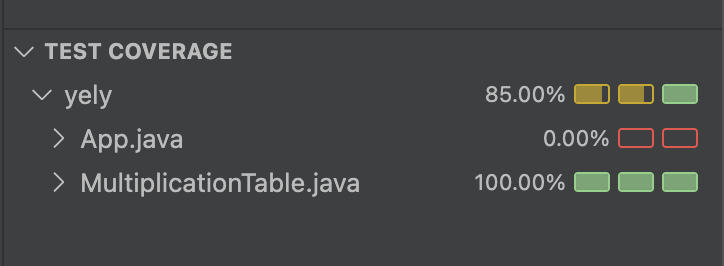

# Multiplication Table

## What does the program do?

The program creates a multiplication table for any integer `n` from 1 to 10.  
The output is a list of strings in the format:

n x i = result

### Example for `n = 5`:

5 x 1 = 5
5 x 2 = 10
5 x 3 = 15
...
5 x 10 = 50

## Requirements

- The class must be tested using unit tests.
- Minimum test coverage: 70%.
- TDD approach used (write test first, then code).
- Technologies: JDK 21, Maven, JUnit 5, Hamcrest.

## What is included in the project?

- Class to generate the multiplication table (MultiplicationTable).
- Tests to verify the class functionality (MultiplicationTableTest).

## 📸 Test Coverage

